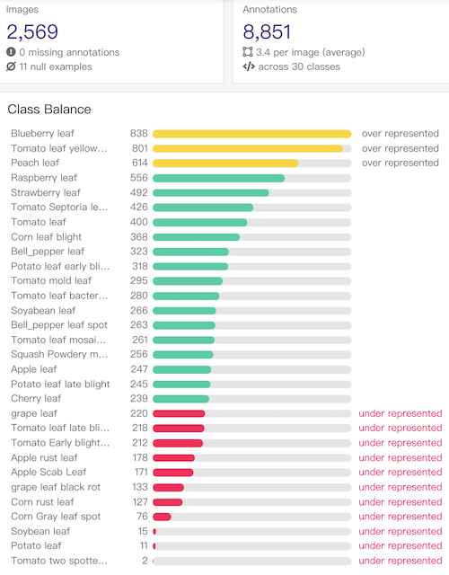
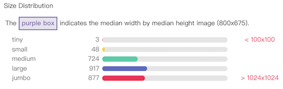

# backend

### Backend project for plant disease detection (Python 3.9.6)

1. install requirements (GPU version)

```shell
# pip
pip install torch torchvision torchaudio --extra-index-url https://download.pytorch.org/whl/cu116

pip freeze > requirements.txt
pip uninstall -r requirements.txt -y
```

2. run backend project

```shell
python app.py
```

3. if `address already in use`

```shell
lsof -i:8081
kill -9 {PID}
```

### class blance



### size distribution



### aspect radio distribution


```txt
import shutil
import os
import shutil
import sys
from typing import Union

import numpy as np
import torch
import uvicorn
from PIL import Image
from PIL import ImageDraw, ImageFont
from fastapi import FastAPI, UploadFile
from fastapi.middleware.cors import CORSMiddleware
from starlette.responses import FileResponse

from utils.utils import (cvtColor, preprocess_input, resize_image)
from yolo import YOLO

app = FastAPI()
app.add_middleware(
    CORSMiddleware,
    allow_origins=["*"],
    allow_credentials=True,
    allow_methods=["GET", "POST"],
    allow_headers=["Content-Type", "X-Requested-With"],
)


@app.post('/upload', response_model=dict)
def upload_file(file: Union[UploadFile, None] = None):
    if file is None:
        return {'status': 0}
    file_name, extend_name = file.filename.split('.')
    ori_path = os.path.join('tmp/ori', file.filename)
    try:
        with open(ori_path, "wb+") as buffer:
            shutil.copyfileobj(file.file, buffer)
    finally:
        file.file.close()
    if extend_name.lower() in ('bmp', 'dib', 'jpeg', 'jpg', 'pbm', 'pgm', 'png', 'ppm', 'tif', 'tiff'):
        det_path = os.path.join('tmp/det', f'{file_name}.png')
        r_image, image_info = yolo.detect_image(Image.open(ori_path))
        r_image.save(det_path, quality=95, subsampling=0)
        return {'status': 1,
                'image_url': 'http://127.0.0.1:8081/' + ori_path,
                'draw_url': 'http://127.0.0.1:8081/' + det_path,
                'image_info': image_info}
    return {'status': 0}


@app.get('/tmp/{fpath:path}')
def show_photo(fpath):
    if fpath is None:
        return {'status': 0}
    filename = fpath.split('/')[1]
    extend_name = filename.split('.')[1]
    if extend_name.lower() in ('bmp', 'dib', 'jpeg', 'jpg', 'pbm', 'pgm', 'png', 'ppm', 'tif', 'tiff'):
        return FileResponse(path=f'tmp/{fpath}', headers={'Content-Type': 'image/png'}, filename=filename)
    return {'status': 0}


if __name__ == '__main__':
    os.chdir(sys.path[0])
    dirs = ['tmp/ori/', 'tmp/det/']
    for dire in dirs:
        if not os.path.exists(dire):
            os.makedirs(dire)
        for file in os.listdir(dire):
            os.remove(os.path.join(dire, file))
    yolo = YOLO()
    mode = "predict"
    uvicorn.run(app, host="0.0.0.0", port=8081)
```